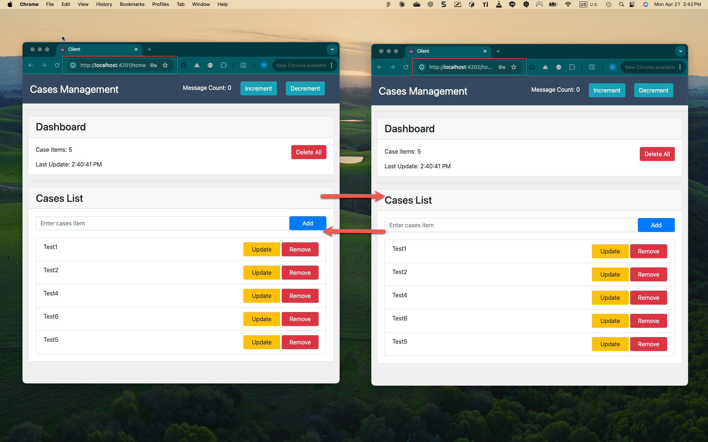

# Client

This is an Angular-based client application that communicates with the Node.js server. The project was generated with [Angular CLI](https://github.com/angular/angular-cli) version 1.7.3.

## Features

- Modern Angular application
- Real-time communication with server via WebSocket
- RESTful API integration
- Responsive design
- Development hot-reload support
- Support for connecting to multiple server instances
- Redux-based state management

## Prerequisites

- Node.js (v14 or higher recommended)
- npm or yarn
- Angular CLI (if you want to generate new components)
- Running server instances (see Server README for setup)
- Redis Server (MUST be installed and running on the server side for data synchronization between servers)

Note: While Redis is not required on the client side, it must be properly configured and running on the server side for the multi-server functionality to work correctly.

## Installation

1. Clone the repository
2. Navigate to the Client directory
3. Install dependencies:
```bash
npm install
```

## Development server

Run `ng serve` for a dev server. Navigate to `http://localhost:4200/`. The app will automatically reload if you change any of the source files.

## Connecting to Server Instances

The client can connect to different server instances. By default, it connects to:
- Server 1: `http://localhost:3001`
- Server 2: `http://localhost:3002`

### Environment Configuration

The client uses environment files to configure server connections:
- `src/environments/environment.ts` - Development environment
- `src/environments/environment.prod.ts` - Production environment

You can modify these files to change the server URLs and ports.

### Multi-Server Support

- The client can connect to multiple server instances simultaneously
- Data is synchronized across all connected servers through Redis
- WebSocket connections are maintained with all active servers
- Real-time updates are received from all connected servers

## Build

Run `ng build` to build the project. The build artifacts will be stored in the `dist/` directory. Use the `-prod` flag for a production build.

## Running unit tests

Run `ng test` to execute the unit tests via [Karma](https://karma-runner.github.io).

## Running end-to-end tests

Run `ng e2e` to execute the end-to-end tests via [Protractor](http://www.protractortest.org/).

## Project Structure

- `src/` - Source code directory
  - `app/` - Application components, services, and modules
    - `redux/` - Redux state management
      - `store.ts` - Root store configuration
      - `cases/` - Case management state
        - `store.ts` - Case reducer and state
        - `actions.ts` - Case-related actions
      - `messaging/` - Messaging state
        - `store.ts` - Messaging reducer and state
        - `actions.ts` - Messaging-related actions
  - `assets/` - Static assets
  - `environments/` - Environment-specific configurations
    - `environment.ts` - Development environment settings
    - `environment.prod.ts` - Production environment settings

## State Management

The application uses Redux for state management with the following features:

### Store Structure
- Root store combining multiple reducers
- Separate state slices for different features
- Immutable state updates using tassign

### State Slices
1. **Case Management**
   - Manages case-related state
   - Actions: Load, Add, Update, Remove, Clear cases
   - State includes cases array and last update timestamp

2. **Messaging**
   - Manages messaging state
   - Actions: Increment and decrement message count
   - State tracks number of new messages

### Key Features
- Immutable state updates
- Type-safe state interfaces
- Clear separation of concerns
- Predictable state changes
- Centralized state management

## Code scaffolding

Run `ng generate component component-name` to generate a new component. You can also use `ng generate directive|pipe|service|class|guard|interface|enum|module`.

## Further help

To get more help on the Angular CLI use `ng help` or check out the [Angular CLI README](https://github.com/angular/angular-cli/blob/master/README.md).

## Screenshot


